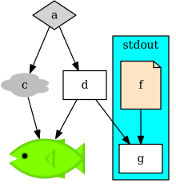
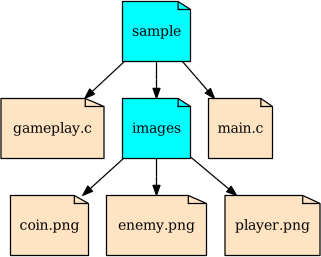

# Racket GraphViz Integration

The goal of this library is to make composition of Racket [Pict](https://docs.racket-lang.org/pict/)
and [Graphviz Diagrams](https://www.graphviz.org/) possible.

The composition is made possible through:
* You can use graphviz diagrams as normal picts
* You can use any Pict as node shape of graphviz diagrams

For example, in the following program note that the shapes for nodes "c" and "f" and also the node with fish shape
are racket shapes. Rest of the nodes use a shape provided by graphviz.


```racket
(digraph->pict
 (make-digraph
  `(["a" #:shape "diamond" #:fillcolor "lightgray" #:style "filled"]
    ["b" #:shape ,(cloud 60 30) #:label "c"]
    ["c" #:shape ,(standard-fish 100 50 #:open-mouth #t #:color "Chartreuse")
         #:label ""]
    "d"
    "a -> b -> c"
    "a -> d -> c"
    (subgraph "stdout" #:style "filled" #:fillcolor "cyan"
              (["f" #:shape ,(file-icon 50 60 "bisque")]
               "g"
               "f -> g"))
    "d -> g")))
```



As another example, take a look at [dirtree.rkt](examples/dirtree.rkt) which dynamically generates a directory tree.



Notice how dirtree.rkt has used `make-vertex` and `make-edge` functions:

```racket
...
(define root (make-vertex (path->string name) #:shape shape))
...
(make-edge root-node sub-node)
...
```

You can pass a list of vertex and edges to `make-digraph` to create a digraph, and use `digraph->pict`
to convert it to a pict.

```racket
(define d (make-digraph (list v1 v2 (make-edge v1 v2))))
(digraph->pict d)
```
