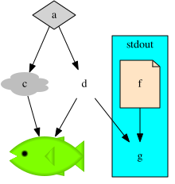
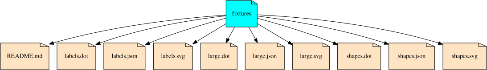

# Racket GraphViz Integration

The goal of this library is to make composition of Racket [Pict](https://docs.racket-lang.org/pict/)
and [Graphviz Diagrams](https://www.graphviz.org/) possible.

The composition is made possible through:
* You can use graphviz diagrams as normal picts
* You can use any Pict as node shape of graphviz diagrams

## Installation

Install Graphviz separately and verify that `dot -Tjson` is available.
The historical JSON prerequisite is Graphviz 2.40.0; actual build
capability matters. Then install the Racket collection:

```sh
raco pkg install graphviz
```

For development from this checkout:

```sh
raco pkg install --name graphviz --link "$PWD"
raco test tests main.rkt lib
```

```racket
#lang racket
(require graphviz file/convertible)

(define graph
  (make-digraph '("start -> finish") #:rankdir "LR" #:nodesep 0.5))
(define picture (digraph->pict graph))
(call-with-output-file "graph.svg"
  (lambda (out) (write-bytes (convert picture 'svg-bytes) out))
  #:exists 'replace)
```

The public structs, constructors, pict re-exports, and port-returning
`run-dot` API remain available. `#:ortho #t` remains a compatibility alias
for `#:splines "ortho"`. Prefer `#:splines` in new code; conflicting
settings produce an error.

GUI applications can have a different PATH from the terminal. Configure
an explicit executable instead of changing the application's environment:

```racket
(parameterize ([current-dot-executable "/opt/local/bin/dot"]
               [current-dot-timeout 60])
  (dot->pict "digraph { a -> b }"))
```

Use your installed path, for example a Homebrew, MacPorts, or Windows
Graphviz executable. The default timeout is 30 seconds for the entire
process operation; `#f` explicitly disables it. `run-dot` returns a fresh
input port containing complete bytes, so PNG as well as textual formats
work. The caller owns that port. `dot->pict` closes its internal port.

For literal colons in names, use `(endpoint "a:b" #f #f)` in an `edge`.
Existing strings such as `"a:n"` retain their port meaning. Node names
are data; use an explicit node list for a name containing `->`.

## Rendering scope

| Feature | Support |
| --- | --- |
| Ellipses, polygons, polylines, cubic splines | Filled and unfilled, including multiple outlines |
| Colors | RGB and RGBA transparency |
| Fonts and labels | Requested faces, anchors, baselines, combined styles, head/tail labels |
| Custom pict nodes | Supported, including nested subgraphs and transformed composition |
| Gradients and external images | Explicit unsupported-operation errors |
| Unknown drawing operations | Contextual errors instead of silent omission |

Installed requested font faces take precedence. Missing faces use
family-compatible aliases (such as Nimbus Roman for Times-Roman) before
the drawing backend's family fallback. Exact pixels can differ between systems; use matching fonts for comparison with native Graphviz.
Superscript/subscript and text decorations use the selected font metrics.
The renderer retains Graphviz layout rather than applying label offsets.

See [CONTRIBUTING.md](CONTRIBUTING.md) for the test matrix, visual gallery,
benchmarks, and release gates. The full API is documented in the Scribble
manual.

## Examples

For example, in the following program note that the shapes for nodes "c" and "f" and also the node with fish shape
are racket shapes. Rest of the nodes use a shape provided by graphviz.


```racket
(digraph->pict
 (make-digraph
  `(["a" #:shape "diamond" #:fillcolor "lightgray" #:style "filled"]
    ["b" #:shape ,(cloud 60 30) #:label "c"]
    ["c" #:shape ,(standard-fish 100 50 #:open-mouth #t #:color "Chartreuse")
         #:label ""]
    "d"
    "a -> b -> c"
    "a -> d -> c"
    (subgraph "stdout" #:style "filled" #:fillcolor "cyan"
              (["f" #:shape ,(file-icon 50 60 "bisque")]
               "g"
               "f -> g"))
    "d -> g")))
```



As another example, take a look at [dirtree.rkt](examples/dirtree.rkt) which dynamically generates a directory tree.



Notice how dirtree.rkt has used `make-vertex` and `make-edge` functions:

```racket
...
(define root (make-vertex (path->string name) #:shape shape))
...
(make-edge root-node sub-node)
...
```

You can pass a list of vertex and edges to `make-digraph` to create a digraph, and use `digraph->pict`
to convert it to a pict.

```racket
(define d (make-digraph (list v1 v2 (make-edge v1 v2))))
(digraph->pict d)
```
